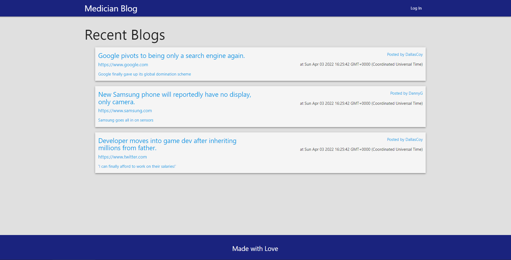
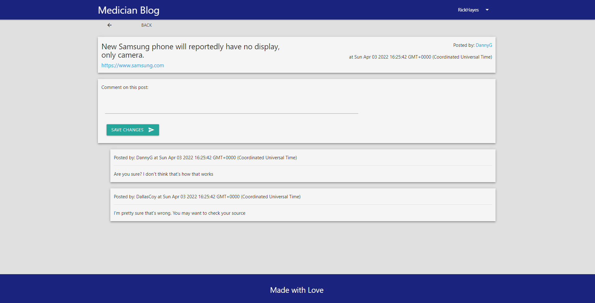
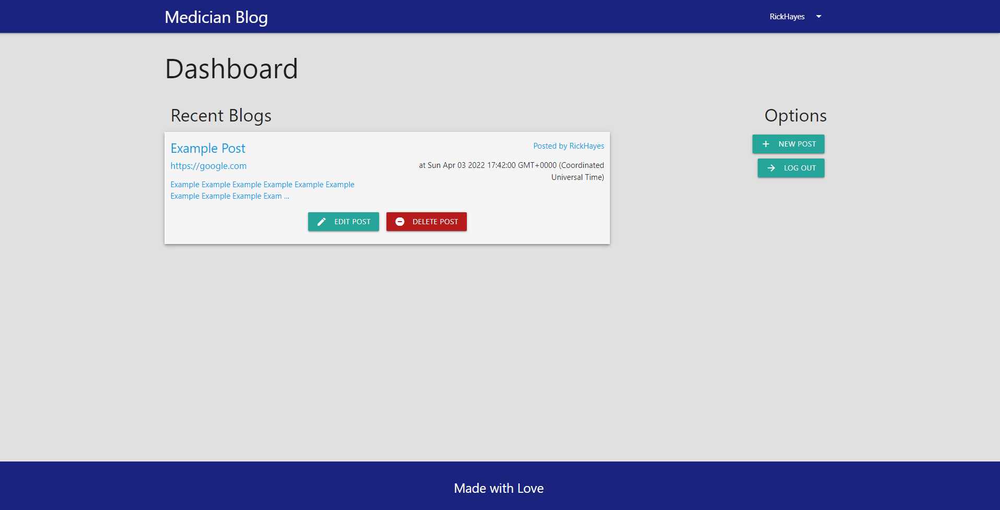

# Basic-Blog
A basic blog site using NodeJS, ExpressJS, MySQL, Sequelize, and Handlebars

## Deployment
<b>Deployed URL: </b> https://medician-blog.herokuapp.com/

## Overview

A basic blog site that allows you to post content, read content from others, and comment on yours and others' posts!

## Features
- Ability to add posts and comments to the site
- User sign up, log in, and content management
- Auto captioning content when no caption is provided

## Local Install
- Run ```npm i``` in the root directory to install dependencies
- Run the ```schema.sql``` file in MySQL to create the database
- Run the package once before adding seed data with ```npm run seed``` in order to create the needed tables!

## Preview
#### Home page


#### Single Post


#### Dashboard
